# About Me

Research Garden: https://spotandjake.github.io/quartz/

Hi my name is Jake, I am currently a computer science student at Trent University. I have been programming since I was 7 so around 13 years now, working on a wide range of projects in various different fields. I used to work primarily in the Javascript world on web development and server side development, in 2019 I got hooked on the world of compiler and programming language design. Currently I have been working on the [Grain programming language](https://github.com/grain-lang/Grain) and designing the next iteration of the [Brisk](https://github.com/spotandjake/Brisk) programming language. I have particular interests in: functional programming, typechecking and designing safe and expressive code.

# Engineering

I was introduced to the world of engineering when I was young and quickly excelled, I used to work primarily in quality control though I have worked through various different job positions, projects and companies.

# Brisk

My favorite project is my uncompleted programming language Brisk. The first iteration has been lost in the sands of time but the goal was to introduce myself to compiler design. The current version in the [Brisk Repo](https://github.com/spotandjake/Brisk) is the 2nd major iteration, it is heavily inspired by Typescript and compiles directly to Webassembly. I have big plans on the horizon as I plan on rewriting the entire project from scratch in Grain with a focus on learning about academic features such as: Hindley-Milner typechecking, wasm component model, and concurrent compiler design, the end goal will be a language similar to Grain but with a combination of abstractions that make it more expressive, reduce abstraction and ride the line between correctness and features.

# Interests

- 🔭 I’m currently working on [Brisk](https://github.com/spotandjake/Brisk) and [grain](https://github.com/grain-lang/Grain)!
- 📫 How to reach me:
  - Discord: spotandjake
  - Here: Open an issue on my profile's repo and I'll respond when I can.
- ⚡ Fun fact: I used to be a mechanical engineer

# Languages

## Languages I Like To Use

## Languages I Know

## Languages I Have Written

# Stats

|  |  |
|---|---|
|  |  |--------------------------------------------------------------------------------------------------|
