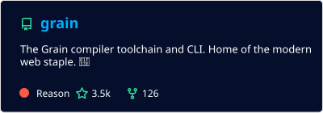
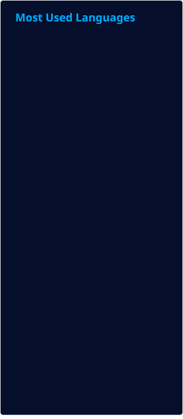
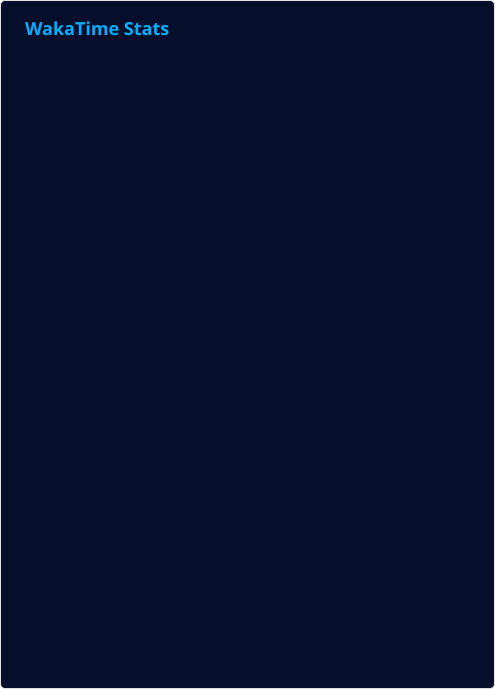

# About Me

Research Garden: https://spotandjake.github.io/quartz/

Hello, my name is Jake. I am currently a computer science undergraduate at Trent University. I have been interested in programming since I was around seven and grew up in the open-source community, working on a wide range of projects across different fields. I started my development journey with JavaScript and full-stack development. In 2019, I became fascinated by compilers and programming language design after discovering Grain. I am now a core team member of the [Grain programming language](https://github.com/grain-lang/Grain), contributing to various parts of the language and its ecosystem. Outside of Grain, I spend much of my time researching compilers, with particular interests in functional programming, type systems, typechecking, and designing safe and expressive languages.

## Compilers & Brisk

Outside of Grain, I have written several compilers, including a basic optimizing compiler for my third-year [AMOD-4901](https://github.com/spotandjake/amod-4901) reading course. However, my favourite compiler project is my unfinished and ever-evolving programming language, [Brisk](https://github.com/spotandjake/Brisk).

I started working on Brisk before I discovered Grain, originally as a way to introduce myself to compiler design. The current version is my second major iteration and was the first time I built a complete multipass compiler from scratch. Heavily inspired by TypeScript, it compiles directly to WebAssembly. Aside from [Chevrotain](https://github.com/Chevrot/chevrotain), which I use for parsing, the compiler and its supporting infrastructure are built from scratch.

As part of Brisk, I also wrote [BriskLinker](https://github.com/spotandjake/BriskLinker), a WebAssembly linker written entirely in Grain. It links WebAssembly modules through a defined ABI designed to make interoperability with other languages straightforward, giving me the opportunity to explore the lower-level details of WebAssembly modules and linking.

While active development on Brisk has slowed down, I have spent the last few years designing a third major iteration focused on simplicity, design unification, typechecking, and higher-level abstractions. Much of this work currently lives in the Brisk section of my [knowledge garden](https://spotandjake.github.io/quartz/Brisk/Brisk).

## Problem Solving

While I love working on compilers, I really enjoy solving problems wherever they appear. Working on Grain has given me experience across a surprisingly broad ecosystem, including OCaml, Reason, Rust, Swift, C, C++, JavaScript, TypeScript, Grain, and a variety of build systems and tooling. I've also spent a lot of time tracking down CI, build, and infrastructure problems, which has taught me to debug systems across multiple layers.

Outside of my main projects, I also enjoy building things simply because they're interesting, from dynamic webpages using only HTML and CSS to graphics experiments and other deliberately impractical projects.

## Engineering

Another interesting part of my background is that I started out in engineering. I was introduced to the world of metrology at a young age and grew up working across a variety of industries in quality control. Over the years, I have gained hands-on experience with a wide range of manufacturing technologies, from 3D printing and laser cutting to operating CNC machines and coordinate measuring machines (CMMs).

## Interests

- 🔭 I currently spend most of my time working on Grain and designing the next iteration of Brisk.
- 📫 How to reach me:
  - Discord: spotandjake
  - GitHub: Open an issue on my profile repository and I'll respond when I can.
- ⚡ Fun fact: Despite my love of compilers, I actually really enjoy high-level programming.

# Languages

## Languages I Like To Use

## Languages I Know

## Languages I Have Written

# Stats

|  |  |
|---|---|
|  |  |--------------------------------------------------------------------------------------------------|
